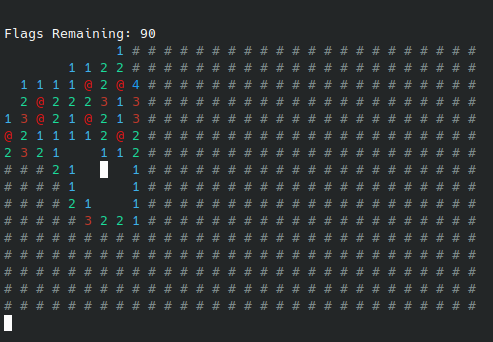
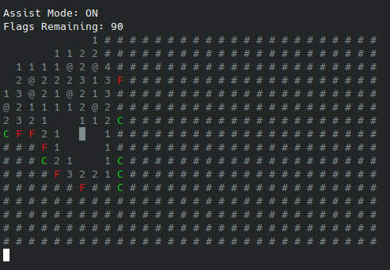

# Terminal Sweeper

Terminal Sweeper is a program that runs Mine Sweeper in your terminal. Terminal Sweeper is also capable of solving Mine Sweeper Games for you. The goal of this repository is to create an accurate and highly optimized Mine Sweeper Solver. 

<p align="center">
  
  
</p>

## Controls

- Arrow keys or WASD to move cursor around
- Enter or E to click a tile or click a menu
- Delete or Q to flag a tile
- F to enter/exit assist mode

## How To Compile

NOTE: Compilation requires that you have [CMake](https://cmake.org/download/) and a [C++ Compiler](https://isocpp.org/get-started) installed.

```bash
    cd /path/to/project/
    mkdir -p build && cd build 
    cmake ..
    make
```

## How To Run
```bash
    # Linux / Mac OS
    ./bin/MineSweeperSolver
```
### How To Run Tests
```bash
    # Linux / Mac OS
    ./bin/test/<ModuleName>
```
### How to Run Benchmarks
```bash
    # Linux / Mac OS
    ./bin/benchmark/<ModuleName>
```

## Packages Used
- [Google Benchmark](https://github.com/google/benchmark)
- [Google Test](https://github.com/google/googletest)
- [Cpp-Terminal](https://github.com/jupyter-xeus/cpp-terminal)

## Todo
- Use the expected value of how many tiles will be gained per click to determine next click.
- Create batchscript to add Terminal Sweeper to paths for easy launch.
- Add option to switch from keyboard control to mouse control.
- Multi Thread Solution Finder
